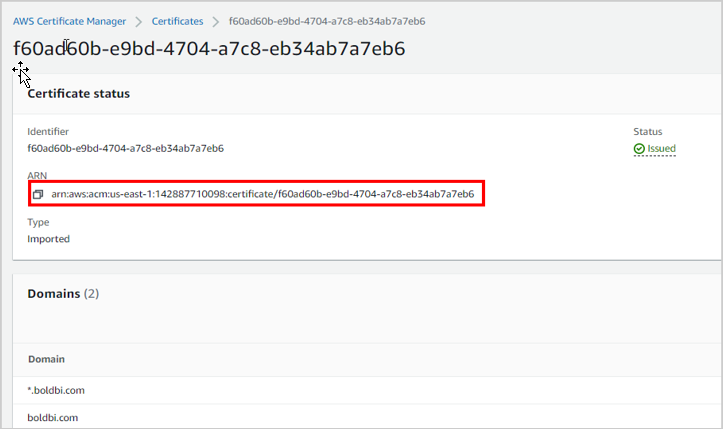

# How to deploy Bold BI in EKS Using Network Load Balancer (NLB) with SSL certificate from AWS Certificate Manager (ACM).

The below section explains how to deploy Bold BI in EKS using Nginx Network Load Balancer (NLB) with an SSL certificate from AWS Certificate Manager (ACM).

## Create a EKS Cluster and filestorage:

1. Create an Amazon EKS cluster and [node group](https://docs.aws.amazon.com/eks/latest/userguide/eks-compute.html) to deploy Bold BI.

   https://docs.aws.amazon.com/eks/latest/userguide/getting-started.html 

2. Create an Amazon Elastic File System (EFS) volume to store the shared folders for application usage by following the link below.

   

3. Connect to your Amazon EKS cluster.
   https://aws.amazon.com/premiumsupport/knowledge-center/eks-cluster-connection/
  
4. Deploy the EFS CSI Driver to your cluster.

   https://docs.aws.amazon.com/eks/latest/userguide/efs-csi.html 

	```console
	kubectl apply -k "github.com/kubernetes-sigs/aws-efs-csi-driver/deploy/kubernetes/overlays/stable/?ref=release-1.7"
	```
	
	> <b>Note:</b> Make sure the following network configurations to avoid volume mounting issues.<br/><br/>
		1. EFS file system in the same region as your EKS cluster.<br/>
		2. Your EKS cluster and EFS file system must be in the same Virtual Private Cloud (VPC).<br/>
		3. The security group for your EFS file system, which will allow incoming traffic from your EKS cluster's nodes.<br/>
		4. Ensure the EFS CSI Driver installation in cluster.<br/>

## Deploy Network Load Balancer with SSL Termination:

1. Download the [deploy.yaml](https://raw.githubusercontent.com/kubernetes/ingress-nginx/controller-v1.8.2/deploy/static/provider/aws/nlb-with-tls-termination/deploy.yaml) template.

2. Edit the deploy.yaml file and change the VPC CIDR for the Kubernetes cluster.

	```console
	proxy-real-ip-cidr: XXX.XXX.XXX/XX
	```
	
	
	
	
3. Change the AWS Certificate Manager (ACM) ID as well:

	```console
	arn:aws:acm:us-west-2:XXXXXXXX:certificate/XXXXXX-XXXXXXX-XXXXXXX-XXXXXXXX
	```
	
	
	

4. Deploy the manifest:
   
   ```console
   kubectl apply -f deploy.yaml
   ```
   
5. Get the external IP and map it with a DNS to craft values.yaml when installing Bold BI with helm chart.
   
   ```console
   kubectl get svc -n ingress-nginx
   ```
   
   
   
6. Check whether you can access the domain name with the secure protocol in browser.
  
   
   
	> **Note:** If you cannot access the URL in browser please ensure the below configuration.<br/><br/>
		1. Ensure that the firewall or security group associated with the NLB allows incoming traffic on port 80 (HTTP) or 443 (HTTPS).<br/>
		2. Make sure that the route to the NLB is correctly configured in your network infrastructure.<br/>
		3. If the NLB is associated with a target group, ensure that the health check for the target group is healthy. The NLB will only forward traffic to healthy targets.<br/>
		4. Ensure that the DNS for the NLB is correctly resolving to the correct IP address.<br/>
		5. Ensure that the Kubernetes service associated with the NLB is correctly configured with the correct selector labels and target port.<br/>
		6. Ensure that there are healthy pods running and associated with the Kubernetes service.<br/>

## Get Repo Info

1. Add the Bold BI helm repository.

```console
helm repo add boldbi https://boldbi.github.io/boldbi-kubernetes
helm repo update
```

2. View charts in repo.

```console
helm search repo boldbi

NAME            CHART VERSION   APP VERSION     DESCRIPTION
boldbi/boldbi   7.9.27           7.9.27         Embed powerful analytics inside your apps and t...
```

_See [helm repo](https://helm.sh/docs/helm/helm_repo/) for command documentation._

## Create Namespace

Run the following command to create the namespace where the Bold BI resources will be deployed in the Kubernetes cluster. The default namespace is <i>bold-services</i>.

```console
kubectl create ns bold-services
```

## Install Chart

For the Helm chart, you need to craft a `values.yaml` file. So download the values.yaml file from [here](https://raw.githubusercontent.com/boldbi/boldbi-kubernetes/main/helm/custom-values/eks-values.yaml) make the required changes.

* Update the appBaseURL, and if necessary, modify the namespace accordingly.
	

* Update the filesystem ID that was previously created.
	

* In the loadBalancer section, change the load balancer type to 'nlb' from 'nginx'.
  	
  
* After making the above changes, run the following command to deploy Bold BI in your cluster.

```console
helm install [RELEASE_NAME] boldbi/boldbi -f [Crafted values.yaml file] -n [Namespace]
```
Ex:  `helm install boldbi boldbi/boldbi -f my-values.yaml -n bold-services`

_See [helm install](https://helm.sh/docs/helm/helm_install/) for command documentation._

## Upgrade

Run the following command to get the latest version of the Bold BI helm chart.

```console
helm repo update
```

Run the following command to apply changes in your Bold BI release or upgrade Bold BI to the latest version.

```console
helm upgrade [RELEASE_NAME] boldbi/boldbi -f [Crafted values.yaml file]
```

Ex:  `helm upgrade boldbi boldbi/boldbi -f my-values.yaml`

## Uninstall Chart

```console
helm uninstall [RELEASE_NAME]
```
Ex:  `helm uninstall boldbi`

This removes all the Kubernetes components associated with the chart and deletes the release.

_See [helm uninstall](https://helm.sh/docs/helm/helm_uninstall/) for command documentation._
