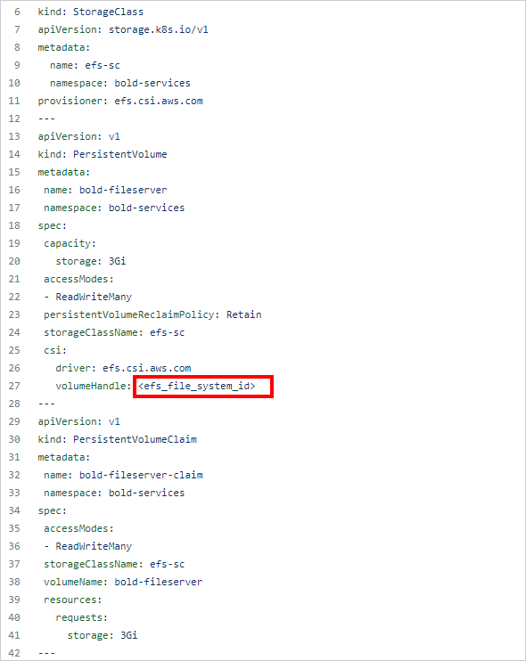
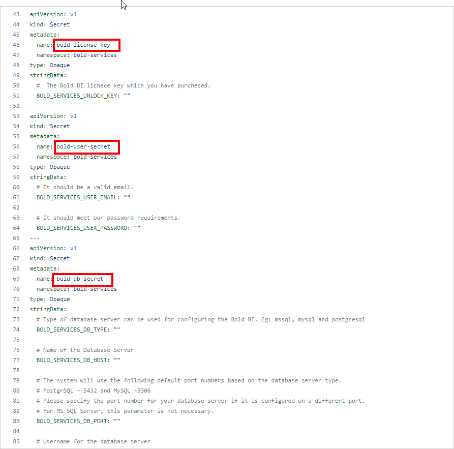
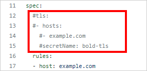
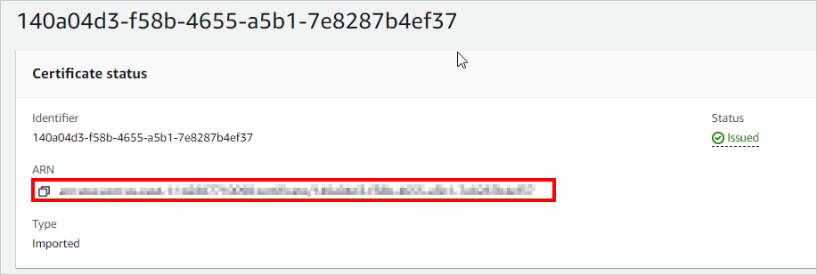
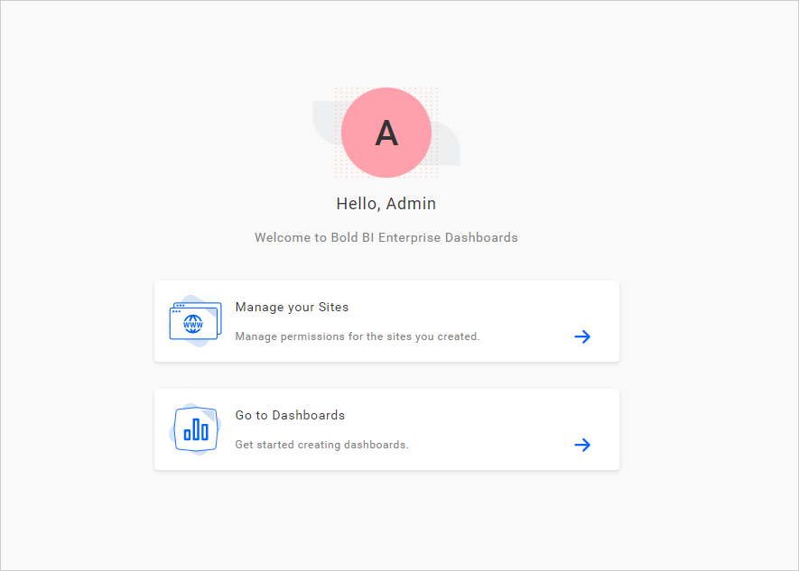
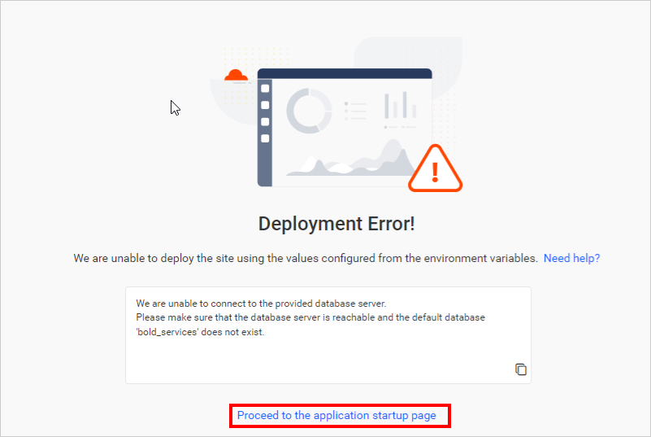

# How to deploy Bold BI in Elastic Kubernetes Services (EKS) using Application Load Balancer (ALB)

The section explains how to deploy [Bold BI](https://www.boldbi.com/) in an EKS cluster using an [Application Load Balancer](https://docs.aws.amazon.com/elasticloadbalancing/latest/application/introduction.html).

1. Create an Amazon EKS cluster and [node group](https://docs.aws.amazon.com/eks/latest/userguide/eks-compute.html) to deploy Bold BI.

   https://docs.aws.amazon.com/eks/latest/userguide/getting-started.html 

2. Create an Amazon Elastic File System (EFS) volume to store the shared folders for application usage by following this [link](https://docs.aws.amazon.com/eks/latest/userguide/efs-csi.html).

   

3. Connect to your Amazon EKS cluster.
   https://aws.amazon.com/premiumsupport/knowledge-center/eks-cluster-connection/
  
4. Deploy the EFS CSI Driver to your cluster.

   https://docs.aws.amazon.com/eks/latest/userguide/efs-csi.html 

	```console
	kubectl apply -k "github.com/kubernetes-sigs/aws-efs-csi-driver/deploy/kubernetes/overlays/stable/?ref=release-1.4"
	```
	
	> <b>Note:</b> Make sure the following network configurations to avoid volume mounting issues.<br/><br/>
		1. EFS file system in the same region as your EKS cluster.<br/>
		2. Your EKS cluster and EFS file system must be in the same Virtual Private Cloud (VPC).<br/>
		3. The security group for your EFS file system, which will allow incoming traffic from your EKS cluster's nodes.<br/>
		4. Ensure the EFS CSI Driver installation in cluster.<br/>
		
5. To install the AWS load balancer controller, please refer to the following documentation.

   https://docs.aws.amazon.com/eks/latest/userguide/aws-load-balancer-controller.html

6. Download the **deploy_eks_alb.yaml** file [here](../../deploy/deploy/deploy_eks_alb.yaml) to deloy Bold BI on AKS.

7. Navigate to the folder where the deployment files were downloaded in above step. 

8. Open the **deploy_eks_alb.yaml** file that was downloaded in Step 6. Replace the file system ID that was created in Step 2 with the `<efs_file_system_id>` placeholder in the file.

   

9. Enter the necessary variable information in the **deploy_eks_alb.yaml** file to complete the auto-deployment, as detailed below.

    * Enter the Bold BI license key, user, and database server details.
	The following environment variables are optional. If not provided, a manual Application start-up configuration is needed.
        
        

        ## Environment variables details for configuring `Application Startup` in the backend.

        | Name                          |Required| Description   | 
        | -------------                 |----------| ------------- |
        |`BOLD_SERVICES_UNLOCK_KEY`|Yes|License key of Bold BI|
        |`BOLD_SERVICES_DB_TYPE`|Yes|Type of database server can be used for configuring the Bold BI.<br/><br />The following DB types are accepted:<br />1. mssql –           Microsoft SQL Server/Azure SQL Database<br />2. postgresql – PostgreSQL Server<br />3. mysql – MySQL/MariaDB Server|
        |`BOLD_SERVICES_DB_HOST`|Yes|Name of the Database Server|
        |`BOLD_SERVICES_DB_PORT`|No|The system will use the following default port numbers based on the database server type.<br />PostgrSQL – 5234<br />MySQL -3306<br         /><br />Please specify the port number for your database server if it is configured on a different port.<br /><br />For MS SQL Server, this parameter is not           necessary.|
        |`BOLD_SERVICES_DB_USER`|Yes|Username for the database server<br /><br />Please refer to [this documentation](https://help.boldbi.com/embedded-bi/faq/what-are-         the-database-permissions-required-to-set-up-bold-bi-embedded/) for information on the user's permissions.|
        |`BOLD_SERVICES_DB_PASSWORD`|Yes|The database user's password|
        |`BOLD_SERVICES_DB_NAME`|No|If the database name is not specified, the system will create a new database called bold services.<br /><br />If you specify a             database name, it should already exist on the server.|
        |`BOLD_SERVICES_POSTGRESQL_MAINTENANCE_DB`|No|For PostgreSQL DB Servers, this is an optional parameter.<br />The system will use the database name `postgres`           by default.<br />If your database server uses a different default database, please provide it here.|
        |`BOLD_SERVICES_DB_ADDITIONAL_PARAMETERS`|No|If your database server requires additional connection string parameters, include them here.<br /><br />Connection         string parameters can be found in the official document.<br />My SQL: https://dev.mysql.com/doc/connector-net/en/connector-net-8-0-connection-options.html<br           />PostgreSQL: https://www.npgsql.org/doc/connection-string-parameters.html<br />MS SQL: https://docs.microsoft.com/en-                       us/dotnet/api/system.data.sqlclient.sqlconnection.connectionstring<br /><br /><b>Note:</b> A semicolon(;) should be used to separate multiple parameters.|
        |`BOLD_SERVICES_USER_EMAIL`|Yes|It should be a valid email.|
        |`BOLD_SERVICES_USER_PASSWORD`|Yes|It should meet our password requirements.|

        <details>
          <summary>
            Example for above environment variables: 
          </summary>

          apiVersion: v1
          kind: Secret
          metadata:  
            name: bold-license-key
            namespace: bold-services
          type: Opaque
          stringData:
            BOLD_SERVICES_UNLOCK_KEY: "@332e332e30fgfTa4NmxTdRataMFgre/GC5AyCj+BHVoCO4ax6M61s=eyJFbWFpbCI6InN1YmJpcmFtYW5peWFuLnRAc3luY2Z1c2lvbi5jb20iLCJQcm9kdWN0cyI6"
          ---
          apiVersion: v1
          kind: Secret
          metadata:  
            name: bold-user-secret
            namespace: bold-services
          type: Opaque
          stringData:
            # It should be a valid email.
            BOLD_SERVICES_USER_EMAIL: "admin@boldbi.com"

            # It should meet our password requirements.
            BOLD_SERVICES_USER_PASSWORD: "Admin@123"
          ---
          apiVersion: v1
          kind: Secret
          metadata:  
            name: bold-db-secret
            namespace: bold-services
          type: Opaque
          stringData:
            # Type of a database server can be used for configuring the Bold BI. For example, mssql, mysql, and postgresql.
            BOLD_SERVICES_DB_TYPE: "postgresql"

            # Name of the Database Server
            BOLD_SERVICES_DB_HOST: "localhost"

            # The system will use the following default port numbers based on the database server type.
            # PostgrSQL – 5432 and MySQL -3306
            # Please specify the port number for your database server if it is configured on a different port.
            # For MS SQL Server, this parameter is not necessary.
            BOLD_SERVICES_DB_PORT: "5432"

            # Username for the database server
            # Please refer to this documentation for information on the user's permissions.
            # https://help.boldbi.com/embedded-bi/faq/what-are-the-database-permissions-required-to-set-up-bold-bi-embedded/
            BOLD_SERVICES_DB_USER: "boldbi@boldbi-docker"

            # The database user's password
            BOLD_SERVICES_DB_PASSWORD: "F8o:z$jasoKkel"

            # If the database name is not specified, the system will create a new database called bold services.
            # If you specify a database name, it should already exist on the server.
            BOLD_SERVICES_DB_NAME: ""

            # For PostgreSQL DB Servers, this is an optional parameter.
            # The system will use the database name postgres by default.
            # If your database server uses a different default database, please provide it here.
            BOLD_SERVICES_POSTGRESQL_MAINTENANCE_DB: "postgres"

            # If your database server requires additional connection string parameters, include them here.
            # Connection string parameters can be found in the official document.
            # My SQL: https://dev.mysql.com/doc/connector-net/en/connector-net-8-0-connection-options.html
            # PostgreSQL: https://www.npgsql.org/doc/connection-string-parameters.html
            # MS SQL: https://docs.microsoft.com/en-us/dotnet/api/system.data.sqlclient.sqlconnection.connectionstring
            # Note: A semicolon(;) should be used to separate multiple parameters.
            BOLD_SERVICES_DB_ADDITIONAL_PARAMETERS: ""
          ---
        </details>
           
    * If you need to use the **Bing Map** widget feature, enter the value for the `widget_bing_map_enable` environment variable as `true` and the API key value for the `widget_bing_map_api_key`.
       
       

10. If you have a DNS to map with the application, proceed to the next steps, otherwise, skip to **Step 13**. 

11. Download the `ingress_alb.yaml` file from [here](https://raw.githubusercontent.com/boldbi/boldbi-kubernetes/main/deploy/deploy/ingress_alb.yaml).Uncomment the host value and replace your DNS hostname with `example.com` in ingress_alb.yaml file in line **18**.

      

	**Note:** Here you need to mention the host without the HTTP or HTTPS protocol.
	
12. If you have the SSL certificate for your DNS and need to configure the site with it, follow these steps of section A or B, otherwise, skip to **Step 13**.

    **A. SSL configuration using TLS secret:**
	* Run the following command to create a TLS secret with your own SSL certificate.

		```sh
		kubectl create secret tls bold-tls -n bold-services --key <key-path> --cert <certificate-path>
		```
        
	* Now, uncomment the `tls` section and replace your DNS hostname with `example.com` in ingress spec and save the file.

		
	
    **B. SSL configuration using ACM ARN:**
       * Create an ACM Certificate for your domain and verify ownership. Note down the `Amazon Resource Name (ARN) of the Certificate` you just created. Find the ARN in the ACM Management Console as follows.
       
       		
       
       * Now, uncommand the following lines and replace your Arn with `Amazon Resource Name (ARN) of the Certificate` in the ingress annotation and save the file.

		 	

13. Apply the `ingress_alb.yaml` by running the following command.

	```sh
	kubectl apply -f ingress_alb.yaml
	```
14. Now, run the following command to get the ingress address.

	```sh
	kubectl get ingress -n bold-services
	```
	Repeat the above command till you get the value in the ADDRESS tab.
	 
	
15. Replace your DNS or Ingress address in `<application_base_url>` place of the **deploy_eks_alb.yaml** file with http or https protocal.

    Ex:  `http://example.com`, `https://example.com`, `http://<ingress_address>`
    
     
    
16. Read the optional client library license agreement from the following link.

    [Consent to deploy client libraries](../docs/consent-to-deploy-client-libraries.md)
    
17. By default, all client libraries for Bold BI will be installed in Kubernetes. However, overwrite them by specifying the required libraries as a comma-separated list in the environment variable noted from the above link.

     

18. Now, run the following commands to deploy Bold BI in your kubernetes cluster.

    ```sh
    kubectl apply -f deploy_eks_alb.yaml
    ```

19. Use the following command to get the pods status.

     ```sh
    kubectl get pods -n bold-services
     ```
     

20. Wait till you see the applications in running state. Then, use your DNS or Ingress address you got from **Step 15**.

     
    
21. If you are facing any issues as shown below, please cross-check whether the auto-deployment variable is correct. If any of the variables are wrong, you need to correct them and redeploy the application. Alternatively, you can click `proceed to the application startup page` and refer to the following link for more details on manually configuring the application startup.
    
    https://help.boldbi.com/embedded-bi/application-startup

    
