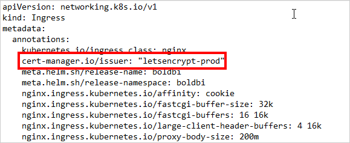
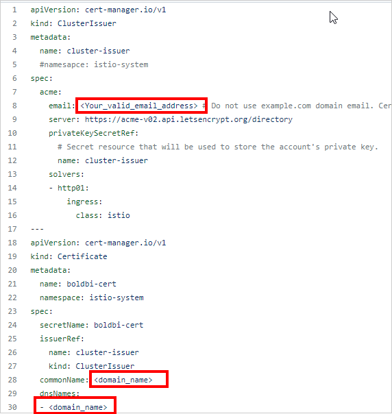
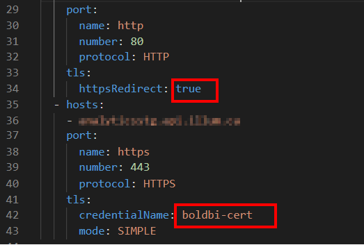

# How to Manually Configure SSL Using Cert Manager in Bold BI Kubernetes Deployment

This section describe how to manually configure ssl using cert manager on Kubernetes. Currently we have provided support for Nginx and Istio as Load Balancers in Bold BI. Please refer the below links for configure ssl based on your load balancer.

* [Configure SSL in Bold BI Kubernetes Deployment with Nginx Using Cert Manager](#configure-ssl-in-bold-bi-kubernetes-deployment-with-nginx-using-cert-manager)

* [Configure SSL in Bold BI Kubernetes Deployment with Istio Using Cert Manager](#configure-ssl-in-bold-bi-kubernetes-deployment-with-istio-using-cert-manager)

## Configure SSL in Bold BI Kubernetes Deployment with Nginx Using Cert Manager

Follow these steps to configure SSL when using the Nginx load balancer in Bold BI Kubernetes deployment:

1. To deploy the Cert Manager in your cluster, create a namespace and install it using helm or kubectl.
	
	Command for deploying Cert Manager using helm:
	
	```console
	helm install cert-manager jetstack/cert-manager --namespace cert-manager --create-namespace --version v1.10.0 --set installCRDs=true --set global.leaderElection.namespace=cert-manager
	
	```

	Command for deploying Cert Manager using kubectl:
	
	```console
	kubectl create ns cert-manager
	
	kubectl apply -f https://github.com/cert-manager/cert-manager/releases/download/v1.8.2/cert-manager.crds.yaml
	
	kubectl apply -f https://github.com/jetstack/cert-manager/releases/download/v1.8.2/cert-manager.yaml
	```
	
	**Note:** After successfully deploying the Cert Manager, verify that the Cert Manager pods are in a running state by using the following command: `kubectl get pods -n cert-manager`.
			
2. Download the <b>nginx-issuer.yaml</b> file from [here](../../ssl-configuration/nginx-issuer.yaml) and replace the `<your_valid_email_address>` with valid email id.

	

3. Apply the nginx-issuer.yaml file and ensure whether the issuer is applied successfully or not by running the following command.

	```console
	kubectl apply -f nginx-issuer.yaml
	
	Kubectl get issuer -n bold-services
	```
	
	

4. By using the following command, edit the ingress and include the annotation `cert-manager.io/issuer: "letsencrypt-prod"` as shown below, then save the changes.

	```console
	kubectl edit ingress -n bold-services
	```

	

5. After saving the above changes, you can access the Bold BI site using a secure https protocol. If you cannot, please open the URL in a new private window and double-check it.


## Configure SSL in Bold BI Kubernetes Deployment with Istio Using Cert Manager

Follow the below steps to configure ssl when using Istio load balancer in Bold BI Kubernetes deployment.

1. To deploy the Cert Manager in your cluster, create a namespace and install it using helm or kubectl.
	
	Command for deploying Cert Manager using helm:
	
	```console
	helm install cert-manager jetstack/cert-manager --namespace cert-manager --create-namespace --version v1.10.0 --set installCRDs=true --set global.leaderElection.namespace=cert-manager
	
	```

	Command for deploying Cert Manager using kubectl:
	
	```console
	kubectl create ns cert-manager
	
	kubectl apply -f https://github.com/cert-manager/cert-manager/releases/download/v1.8.2/cert-manager.crds.yaml
	
	kubectl apply -f https://github.com/jetstack/cert-manager/releases/download/v1.8.2/cert-manager.yaml
	```
	
	**Note:** After successfully deploying the Cert Manager, verify that the Cert Manager pods are in a running state by using the following command: `kubectl get pods -n cert-manager`.
	
2. Download the <b>istio-cert-issuer.yaml</b> file from [here](../../ssl-configuration/istio-cert-issuer.yaml) and replace the `<your_valid_email_address>` with valid email id and <domain_name> with your domain name which you have used for Bold BI deployment.

	

3. Apply the istio-cert-issuer.yaml file and ensure whether the issuer is applied successfully by running the following commands.

    ```console
	kubectl apply -f istio-cert-issuer.yaml
	
	Kubectl get issuer -n clusterissuer
	
	Kubectl get certificate -n istio-system
	```
	
	
	
	

4. Edit the Bold BI gateway file with the created secret name by running the following command.

	```console
	Kubectl edit gateway -n bold-services
	```
	

5. After saving the above changes, you can access the Bold BI site using a secure https protocol. If you cannot, please open the URL in a new private window and double-check it.

