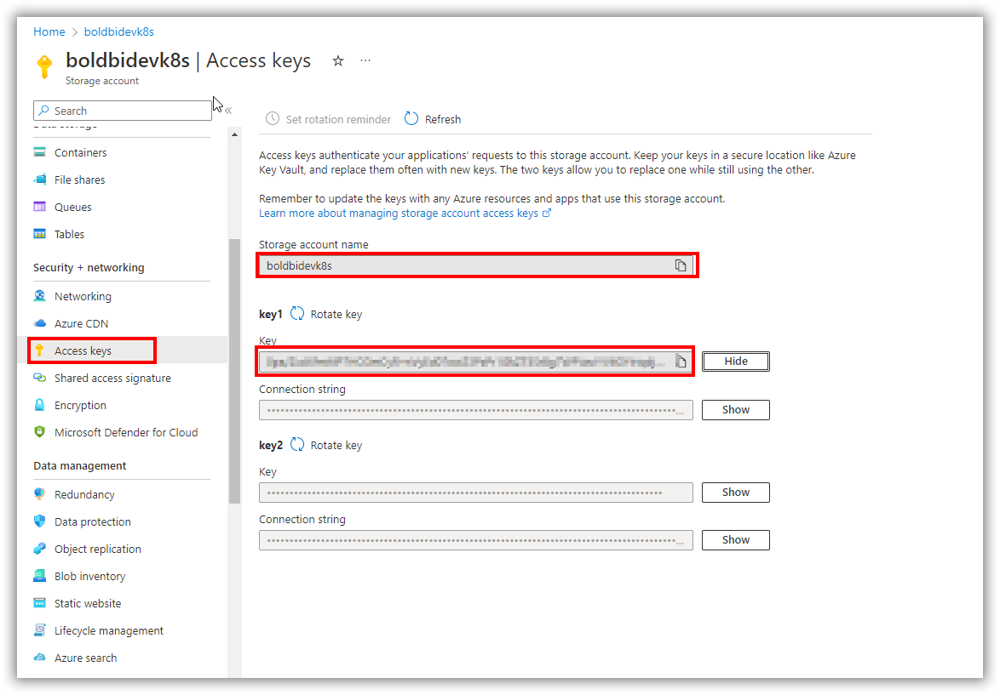

# Configure Persistent Volume For Bold BI.

## Azure Kubernetes Service

1. Create a File share instance in your storage account and note the File share name to store the shared folders for application usage.

2. Encode the storage account name and storage key in base64 format.
  For encoding the values to base64 please run the following command in powershell

  ```console
  [System.Convert]::ToBase64String([System.Text.Encoding]::UTF8.GetBytes("<plain-text>"))
  ```

   

3. Open **pvclaim_aks.yaml** file, downloaded in **Step 1**. Replace the **base64 encoded storage account name**, **base64 encoded storage account key**, and **File share name** noted in above steps to `<base64_azurestorageaccountname>`, `<base64_azurestorageaccountkey>`, and `<file_share_name>` places in the file respectively. You can also change the storage size in the YAML file.

  


## Google Kubernetes Engine

1. Create a Google filestore instance to store the shared folders for application usage.

   https://console.cloud.google.com/filestore 

2. Note the **File share name** and **IP address** after creating filestore instance.

  

3. Open **pvclaim_gke.yaml** file, downloaded in **Step 1**. Replace the **File share name** and **IP address** noted in above step to the `<file_share_name>` and `<file_share_ip_address>` places in the file. You can also change the storage size in the YAML file. Save the file once you replaced the file share name and file share IP address.

  


