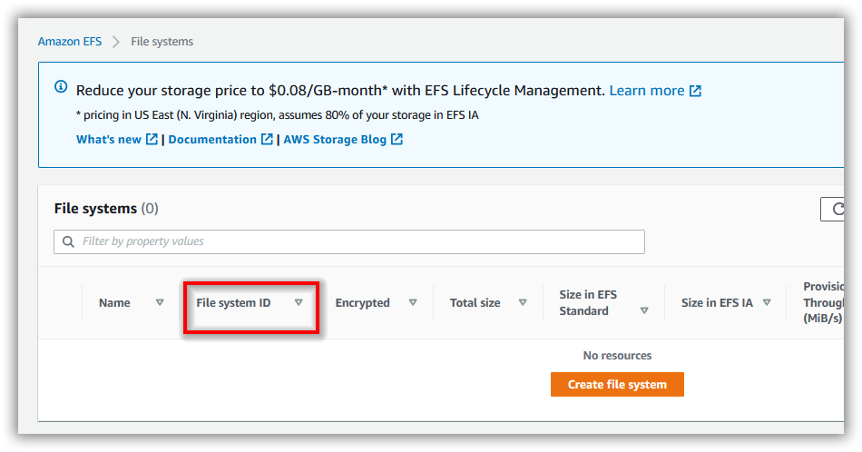

# Deployment Pre-requisites

## File Storage

* [Google Kubernetes Engine (GKE)](#gke-file-storage)
* [Amazon Elastic Kubernetes Service (EKS)](#eks-file-storage)
* [Azure Kubernetes Service (AKS)](#aks-file-storage)
* [On-premise](#on-premise-file-storage)

### GKE File Storage

1. Create a Google filestore instance to store the shared folders for application usage.

   https://console.cloud.google.com/filestore 

2. Note the **File share name** and **IP address** after creating filestore instance.


### EKS File Storage

1. Deploy the EFS CSI Driver to your cluster and create an Amazon Elastic File System (EFS) volume to store the shared folders for application usage by following the below link.

   https://docs.aws.amazon.com/eks/latest/userguide/efs-csi.html 

2. Note the **File system ID** after creating EFS file system.



### AKS File Storage

1. Create a File share instance in your storage account and note the File share name to store the shared folders for application usage.

2. Encode the storage account name and storage key in `base64` format.

For encoding the values to base64 please run the following command in powershell

```console
[System.Convert]::ToBase64String([System.Text.Encoding]::UTF8.GetBytes("<plain-text>"))
```


### On-Premise File Storage

Create a folder in your machine to store the shared folders for application usage.

Ex:  `D://app/shared`

Mention this location in install command as like below,
	
Ex:  `D://app/shared` -> `/run/desktop/mnt/host/d/app/shared`


## Create and connect a cluster

* [Google Kubernetes Engine (GKE)](#gke-cluster)
* [Amazon Elastic Kubernetes Service (EKS)](#eks-cluster)
* [Azure Kubernetes Service (AKS)](#aks-cluster)
* [On-premise](#on-premise-cluster)

### GKE Cluster

1. Create a Kubernetes cluster in Google Cloud Platform (GCP) to deploy Bold BI.

   https://console.cloud.google.com/kubernetes 

2. Connect with your GKE cluster.

   https://cloud.google.com/kubernetes-engine/docs/quickstart

### EKS Cluster

1. Create an Amazon EKS cluster and [node group](https://docs.aws.amazon.com/eks/latest/userguide/eks-compute.html) to deploy Bold BI.

   https://docs.aws.amazon.com/eks/latest/userguide/getting-started.html 

2. Connect to your Amazon EKS cluster.
   https://aws.amazon.com/premiumsupport/knowledge-center/eks-cluster-connection/

### AKS Cluster

1. Create a Kubernetes cluster in Microsoft Azure Kubernetes Service (AKS) to deploy Bold BI.
   https://docs.microsoft.com/en-us/azure/aks/kubernetes-walkthrough-portal

2. Connect with your Microsoft AKS cluster.
   https://docs.microsoft.com/en-us/azure/aks/kubernetes-walkthrough-portal#connect-to-the-cluster

### On-Premise Cluster

1. Create a Kubernetes onpremise cluster to deploy Bold BI.

2. Follow the instructions to [Create an On-Premise cluster](https://kubernetes.io/docs/setup/).

## Image Tag

In common helm deployment we need to give a image tag for Bold BI, Bold Reports and ID. It's default set a latest version tags. You can change a version of Tag based on requirments and overides the image tag whose default is the chart appVersion.<br>
  <b>idTag: 5.2.48<br>
  biTag: 5.2.48<br>
  reportsTag: 3.3.23</b>


## Load Balancing

Currently we have provided support for `Nginx` and `Istio` as Load Balancers in Bold BI. By default Nginx is used as reverse proxy for Bold BI.

### Ingress-Nginx

If you need to configure Bold BI with Ingress, [Install Nginx ingress controller](https://kubernetes.github.io/ingress-nginx/deploy/) in your cluster please refer below and run the command accordingly.

<br/>
<table>
    <tr>
      <td>
       <b>Name</b>
      </td>
      <td>
       <b>Description</b>
      </td>
    </tr>
    <tr>
      <td>
       GKE Cluster
      </td>
      <td>
       kubectl apply -f https://raw.githubusercontent.com/kubernetes/ingress-nginx/controller-v0.41.2/deploy/static/provider/cloud/deploy.yaml
      </td>
    </tr>
    <tr>
      <td>
       EKS Cluster
      </td>
      <td>
       kubectl apply -f https://raw.githubusercontent.com/kubernetes/ingress-nginx/controller-v0.41.2/deploy/static/provider/aws/deploy.yaml
      </td>
    </tr>
    <tr>
      <td>
       AKS Cluster
      </td>
      <td>
       kubectl apply -f https://raw.githubusercontent.com/kubernetes/ingress-nginx/controller-v0.41.2/deploy/static/provider/cloud/deploy.yaml
      </td>
    </tr>
    <tr>
      <td>
       OnPremise
      </td>
      <td>
       kubectl apply -f https://raw.githubusercontent.com/kubernetes/ingress-nginx/controller-v0.41.2/deploy/static/provider/cloud/deploy.yaml
      </td>
    </tr>
</table>
<br/>

### Istio Ingress Gateway

If you need to configure Bold BI with Istio, [Install Istio ingress gateway](https://istio.io/latest/docs/setup/install/) in your cluster please refer to the corresponing reference links

<br/>
<table>
    <tr>
      <td>
       <b>Name</b>
      </td>
      <td>
       <b>Description</b>
      </td>
    </tr>
    <tr>
      <td>
       GKE Cluster
      </td>
      <td>
      https://cloud.google.com/istio/docs/istio-on-gke/installing
      </td>
    </tr>
    <tr>
      <td>
       EKS Cluster
      </td>
      <td>
       https://aws.amazon.com/blogs/opensource/getting-started-istio-eks/
      </td>
    </tr>
    <tr>
      <td>
       AKS Cluster
      </td>
      <td>
       https://docs.microsoft.com/en-us/azure/aks/servicemesh-istio-install
      </td>
    </tr>
    <tr>
      <td>
       OnPremise
      </td>
      <td>
       https://istio.io/latest/docs/setup/platform-setup/docker/
      </td>
    </tr>
</table>
<br/>

### Get Ingress IP

Run the following command to get the ingress IP address.

```console
# Nginx
kubectl get service/ingress-nginx-controller -n ingress-nginx

# Istio
kubectl get service/istio-ingressgateway -n istio-system
```

Note the ingress `EXTERNAL-IP` address and map it with your DNS. If you do not have the DNS and want to use the application, then you can use the ingress IP address.